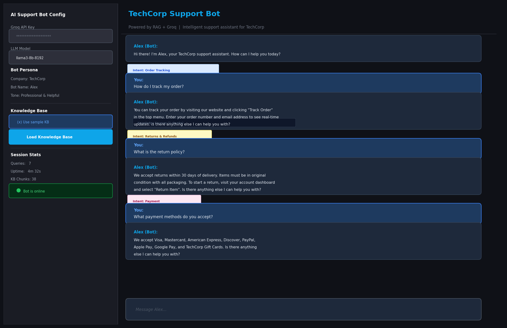

# 🤖 AI Customer Support Bot

An intelligent customer support chatbot powered by **RAG + Groq LLM**. Upload your company's FAQs or policy docs — the bot learns instantly and answers customer queries with precision, empathy, and zero hallucination. Includes smart escalation to human agents when needed.


---

## 🎯 Live Demo Output

### Chat Interface — Multi-turn Support Conversation


### Smart Escalation Flow


---

## 📌 Overview

Traditional rule-based chatbots break on unexpected questions. This bot uses **RAG**:
- Retrieves relevant chunks from your knowledge base
- Generates natural, grounded answers via Groq LLM
- Detects intent automatically (orders, returns, payments, etc.)
- Escalates gracefully when it can't find an answer

---

## ✨ Features

| Feature | Details |
|---------|---------|
| 📚 Custom KB | Upload PDFs/TXT — bot learns instantly |
| 🎯 Intent Detection | 11 intent categories auto-classified |
| 🤖 Multi-turn Chat | Full conversation history maintained |
| 🚨 Smart Escalation | Redirects to human when answer not found |
| 🎭 Configurable Persona | Company name, bot name, response tone |
| ⚡ Groq Powered | Free tier, ultra-fast inference |
| 💡 Quick Suggestions | One-click common question shortcuts |

---

## 🏗️ Architecture

```
Customer Message
      │
      ▼
IntentDetector (keyword-based, 11 categories)
      │
      ▼
KnowledgeBase.search() → FAISS similarity search
      │
      ├── Relevant chunks found ──► Responder (RAG prompt + Groq LLM)
      │                                        │
      └── No relevant chunks ─────► Escalation Response
                                    (connect to human agent)
```

---

## 📁 Project Structure

```
AI-Customer-Support-Bot/
├── app.py                      # Main Streamlit application
├── src/
│   ├── __init__.py
│   ├── knowledge_base.py       # KB loader + FAISS index + sample FAQ
│   ├── intent_detector.py      # Keyword-based intent classifier
│   ├── responder.py            # RAG response generator + escalation
│   └── conversation.py         # Multi-turn history manager
├── tests/
│   └── test_support_bot.py     # Unit tests
├── outputs/
│   ├── demo_support_chat.png   # Chat interface screenshot
│   └── demo_escalation.png     # Escalation flow screenshot
├── knowledge_base/             # Place your KB files here
├── requirements.txt
├── .env.example
├── .gitignore
└── README.md
```

---

## ⚙️ Setup & Installation

### 1. Clone the repo
```bash
git clone https://github.com/NandithKumar/AI-Customer-Support-Bot.git
cd AI-Customer-Support-Bot
```

### 2. Create virtual environment
```bash
python -m venv venv
source venv/bin/activate    # Linux/Mac
venv\Scripts\activate       # Windows
```

### 3. Install dependencies
```bash
pip install -r requirements.txt
```

### 4. Add Groq API key
```bash
cp .env.example .env
# Edit .env and add your key
```
👉 Free key at [console.groq.com](https://console.groq.com)

### 5. Run
```bash
streamlit run app.py
```

---

## 🎯 Intent Categories

| Intent | Trigger Keywords |
|--------|----------------|
| Order Tracking | track, order, shipping status, delivered |
| Returns & Refunds | return, refund, exchange, money back |
| Payment | pay, payment, card, billing, discount |
| Technical | not working, error, broken, issue |
| Product Info | price, available, stock, features |
| Account | password, login, sign in, reset |
| Contact | contact, phone, email, hours, human |
| Warranty | warranty, guarantee, defect |
| Complaint | angry, frustrated, complaint |

---

## 🧪 Tests

```bash
python -m pytest tests/
```

---

## 👤 Author

**Paladugu Nandith Kumar**
- 🎓 B.Tech CSE (AI & ML) — RGMCET, Kadapa
- 💼 [LinkedIn](https://www.linkedin.com/in/paladugunandith/)
- 🌐 [Portfolio](https://monumental-alfajores-8fa62e.netlify.app/)
- 📧 nandith1411@gmail.com

---

## 📄 License
MIT License
